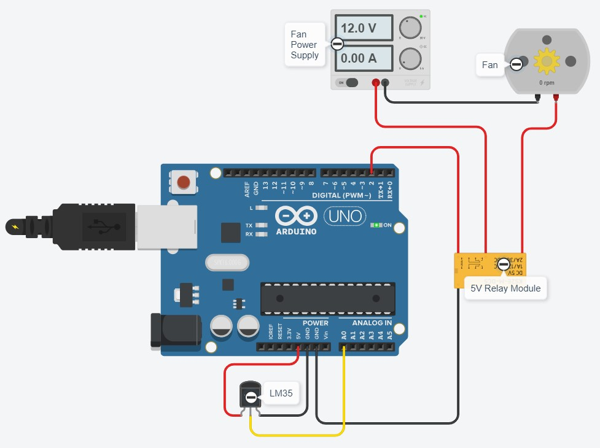

# Temperature Controlled Fan

## Description
Often an enclosure is required when printing materials such as ABS and PETG, those familiar with 3D printing will know the reasons in depth. To those who aren't familiar, the basic reason is certain types of plastic need to be kept hot while a print is running as they shrink when cooling and can detatch from the print bed due to uneven cooling causing warping. I built an enclosure using corflute (corflute is that plastic they make some signs out of) which turned out to be too effective at retaining heat and my enclosure's internal temperature got far too hot and risked damaging the electronics of the printer.

## Planning
I decided to design a circuit which would monitor the temperature inside the enclosure, and if it goes above a certain temperature turn on a fan to expel some of the hot air. I decided it would probably be easiest to use an Arduino and an LM35 temperature sensor along with the other necessary components.

At the beginning of the project I though about making a fan vent which could be opened and closed with a servo to lock the heat in when the fan is not operating, however I decided that over complicated things and that a slatted vent on each side of the fan would be sufficient.

## The Circuit
The circuit is really rather simple, in fact it would be a good example of when to use an Arduino Nano, but as I have a 12v power supply already going in to the enclosure for the lights I decided to just use an Arduino Uno so I can run it off the 12v I have available. 
See the circuit diagram below for full details, you can see there are just 2 components added to the Uno, the LM35 temp sensor and a standard 5v relay breakout board to control the fan. I could have probably used a transistor for the fan control but I had the relay board spare and no transistors around.

## The Code
The code is a mixture of my own and some I found online for how to calculate the temperature from the voltage that the LM35 returns. It's quite short as there's not much to the circuit, and it is almost certainly in need of a good refactor, but it works and I think it is really readable by humans too. Code is available in this repo if you want to have a look or download it for your own projects.

## Construction
Construction of the circuit and 3d printed parts is fairly simple, if you have a 3D printer and access to electrical components at a realistic price of course. You'll need 2 of the fan vents (of which the .STL is included in this repo), the electrical components outlined above, and a few dupont jumper wires. I recommend printing the vents out of PETG because I did have a PLA tool holder inside my enclosure and I noticed the heat from printing PETG actually warped the PLA part. Once you have attached the relay and LM35 to the Uno you should be good to upload the code using the Arduino IDE or whatever else you may use for programming Arduino boards. The last step would be to use the N/O and COM connections on the relay to switch the + or - wire going to the fan, it's just 12V DC so it really makes no difference which wire you add the switch to.

## Testing
To test everything is working set the MINTEMP integer to a temperature just below the temperature of the room you're in, and the MAXTEMP to something about 5 degrees hotter. If everything is working then you'll hear/see the relay click on once the temperature of the LM35 is above the MAXTEMP value, and then it should click back off once the temparture goes back below the MINTEMP value. This program includes calculations to convert the voltage value from the LM35 into Celsius temperatures so keep that in mind when setting the MINTEMP and MAXTEMP values.

## Operation
There really isn't much to say here, the whole point of the project was to make an automated fan which I can basically set and forget. Once you have it installed on your enclosure it should just take care of itself.

## Future
At the moment the only way to get feedback about the temperature is to have the Uno connected via USB to a PC and run the serial monitor. I have some 4-digit 7-segment display modules on the way from China which I plan to use to display the current temperature in place of the current serial output. The first update of this project will be the inclusion of them.

Once I have the 7-segment display I will design a 3D printable enclosure for the arduino and display to neaten everything up.

I am planning to add a button to the Arduino circuit to allow the fan to be activated even if the set maximum temperature has not been exceeded. This would be useful for those days in winter when it's so cold that even PLA warps, it would allow me to shut the door of the enclosure to keep the cold out but also run the fan to stop too much heat building up in the enclosure.

I might look at perhaps adding a few buttons and some code to allow the user to set the MINTEMP and MAXTEMP values without having to change them in the sketch and re-upload it to the Arduino, however to stop the changed values being lost after a power cycle would I think require using the EEPROM on the Arduino which is beyond the scope of my current knowledge.

I will likely keep an eye on the temperature of the voltage drop circuitry on the Uno to make sure it isn't running too hot, and if so I will switch to using a Nano.

I will continue to update the readme until I have added all the features and feel the project is completed. Thanks for taking a look!
